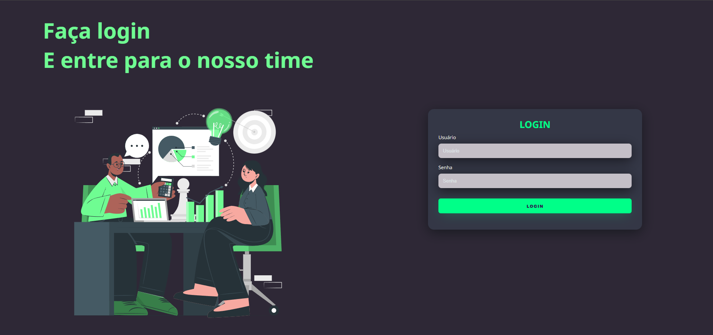

# 💚 Modern Green Login UI

Interface de login moderna com layout dividido e ilustração lateral, desenvolvida com HTML5 e CSS3.  
O projeto utiliza um design escuro com destaque em verde neon para criar contraste e identidade visual forte.

---

## 📸 Preview

Adicione aqui uma imagem do projeto:

---

## 🚀 Funcionalidades

- 🎨 Layout dividido (Ilustração + Formulário)
- 🌙 Tema escuro moderno
- 💚 Destaques em verde neon
- 🖥️ Interface limpa e organizada
- 📱 Estrutura preparada para responsividade
- 🧩 Separação clara entre conteúdo e formulário

---

## 🛠️ Tecnologias Utilizadas

- HTML5  
- CSS3  
- Flexbox  
- Google Fonts  
- Ilustração SVG  

---
## 🎨 Conceitos Aplicados

- `display: flex`
- `justify-content`
- `align-items`
- `box-shadow`
- `border-radius`
- `hover effects`
- Estilização de inputs
- Organização semântica

---

## 📱 Responsividade

O projeto pode ser facilmente adaptado para dispositivos móveis utilizando:

- Media Queries
- Flex-direction: column
- Ajustes de largura em porcentagem

---

## 💡 Objetivo do Projeto

Este projeto foi desenvolvido para:

- Treinar criação de layout profissional
- Trabalhar com contraste de cores
- Desenvolver UI moderna
- Criar projeto para portfólio

---

## 🔮 Melhorias Futuras

- ✅ Validação com JavaScript
- 🔐 Integração com backend
- 📱 Versão totalmente responsiva
- ✨ Animações nos inputs
- 🌗 Alternância de tema

---

## 👩‍💻 Desenvolvido por

**Byanca Matos**

---

⭐ Se você gostou do projeto, deixe uma estrela no repositório!

